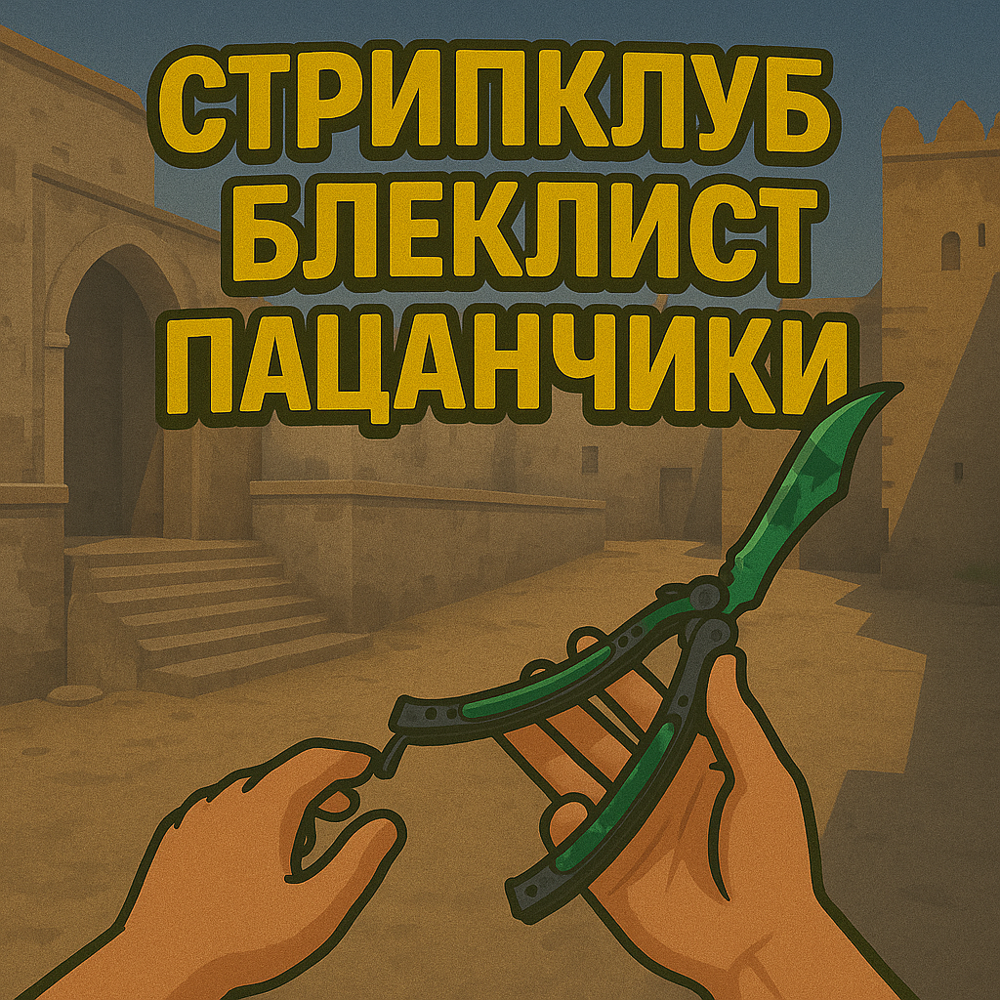
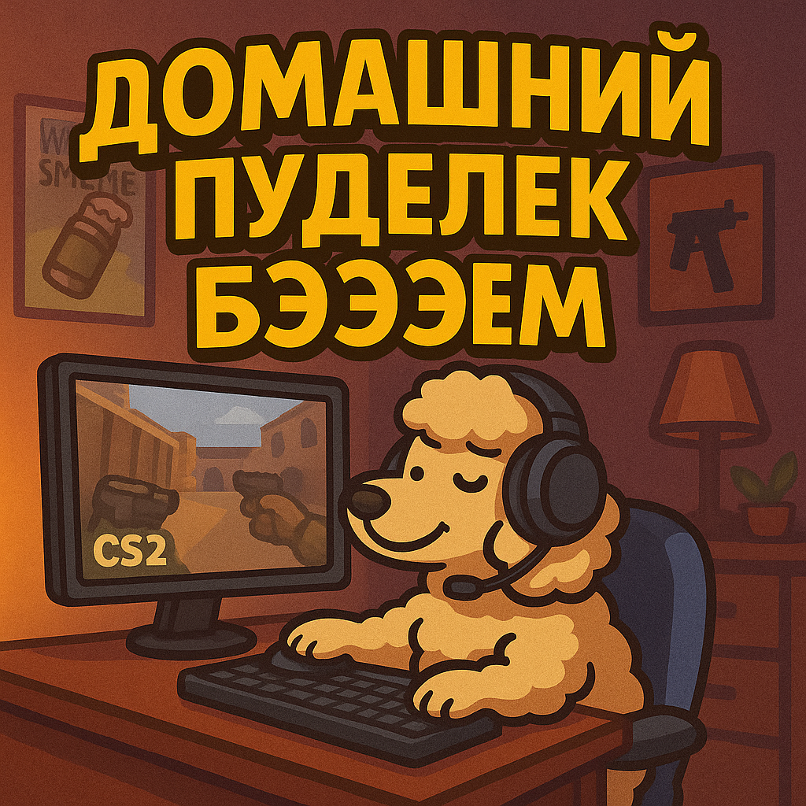

# Anubis — Раскиды и Стратегии

## 🧨 Раскиды

| Тип гранаты | Назначение / Позиция         | Видео |
|-------------|------------------------------|-------|
| Smoke               | All T side smokes               |  |
| Smoke               | B door + B window               |  |
| Smoke               | Mid doors                       |  |

## 📌 Стратегии

-   :material-clock-fast:{ .lg .middle } __Default__

    ---  

    !!! tip "ВАЗЕЛИНОВЫЙ ШЕРШАВЧИК" 
    

-   :simple-counterstrike:{ .lg .middle } __Fast B Execute__  

    ---  
    
    !!! example "B EXECUTE"  
    [:octicons-video-24: Смотреть видео](https://www.youtube.com/watch?v=kpmh_-j3RQ4)

